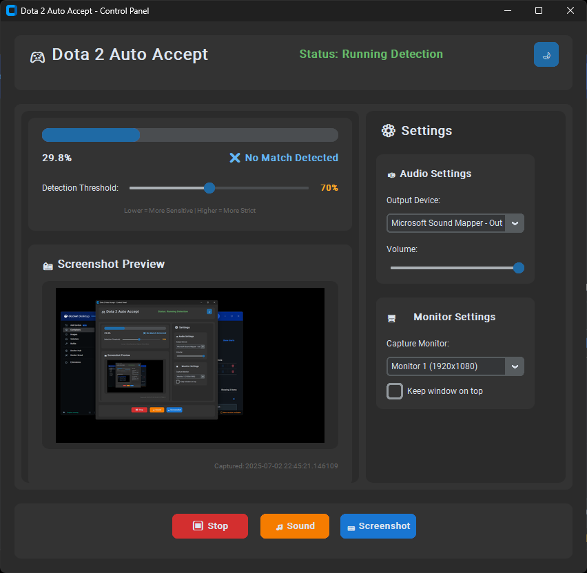

# Dota 2 Auto Accept 🎮



**Version:** 1.0.0

An intelligent application that automatically detects and accepts Dota 2 matches using computer vision and image recognition. Built with a clean MVC architecture and featuring both classic and modern UI themes.

## ✨ Features

- **🔍 Smart Detection**: Uses OpenCV and template matching to detect Dota 2 match acceptance dialogs
- **🎵 Audio Alerts**: Customizable sound notifications when a match is found
- **📱 Modern UI**: Beautiful dark-themed interface with CustomTkinter
- **🖥️ Multi-Monitor Support**: Works across multiple monitors
- **⚙️ Configurable Settings**: Adjustable volume, sensitivity, and detection preferences
- **🎯 Auto Focus**: Automatically brings Dota 2 window to focus when match found
- **📊 Real-time Monitoring**: Live screenshot preview and detection statistics
- **🔧 Easy Setup**: One-click build script and executable generation

## 🚀 Quick Start

### Running from Source

1. **Clone the repository**

   ```bash
   git clone <repository-url>
   cd auto_accept
   ```

2. **Install dependencies**

   ```bash
   cd src
   pip install -r requirements.txt
   ```

3. **Run the application**

   ```bash
   python main.py
   ```

### Building Executable

Use the included PowerShell script to build a standalone executable:

```powershell
.\build_and_run.ps1
```

This will:

- Install PyInstaller if needed
- Bundle all assets (images, sounds, configs)
- Create a portable .exe file
- Auto-increment version number

## 🎮 How to Use

1. **Launch the application** - Run `main.py` or the built executable
2. **Configure settings** - Adjust audio device, volume, and monitor selection
3. **Start detection** - Click "Start Detection" to begin monitoring
4. **Queue for Dota 2** - Start searching for a match in Dota 2
5. **Automatic acceptance** - The app will detect and accept matches automatically

## ⚙️ Configuration

The application stores settings in `src/config.json`:

```json
{
  "alert_volume": 0.23,
  "selected_device_id": 6,
  "selected_monitor_capture_setting": 2,
  "always_on_top": true,
  "enhanced_window_focus": true,
  "auto_focus_on_detection": true,
  "focus_retry_attempts": 3,
  "focus_delay_ms": 100,
  "ui_theme": "dark",
  "use_modern_ui": true
}
```

### Settings Explained

- **alert_volume**: Volume level for match notifications (0.0 - 1.0)
- **selected_device_id**: Audio output device ID
- **selected_monitor_capture_setting**: Which monitor to capture (0, 1, 2...)
- **always_on_top**: Keep application window on top
- **enhanced_window_focus**: Advanced window focusing features
- **auto_focus_on_detection**: Automatically focus Dota 2 when match found
- **use_modern_ui**: Enable modern CustomTkinter interface

## 🏗️ Architecture

The application follows a clean **Model-View-Controller (MVC)** pattern:

```text
src/
├── main.py                 # Entry point
├── config.json            # Application configuration
├── requirements.txt       # Python dependencies
├── controllers/           # Business logic controllers
│   ├── main_controller.py
│   └── detection_controller.py
├── models/                # Data models and core logic
│   ├── audio_model.py
│   ├── config_model.py
│   ├── detection_model.py
│   ├── screenshot_model.py
│   └── window_model.py
├── views/                 # User interface
│   ├── main_view.py       # Classic Tkinter UI
│   └── modern_main_view.py # Modern CustomTkinter UI
└── bin/                   # Assets (images, sounds, icons)
    ├── dota.png
    ├── dota2_plus.jpeg
    ├── dota2.mp3
    └── icon.ico
```

## 🔧 Dependencies

### Core Dependencies

- **OpenCV** (`cv2`) - Computer vision and image processing
- **NumPy** - Numerical operations for image analysis
- **Pillow (PIL)** - Image handling and manipulation
- **MSS** - Fast screenshot capture
- **PyAudio** - Audio playback for notifications

### UI Dependencies

- **Tkinter** - Classic GUI framework (built-in)
- **CustomTkinter** - Modern themed UI components
- **PyQt5** - Alternative GUI framework support

### Build Dependencies

- **PyInstaller** - Executable creation and bundling
- **Auto-py-to-exe** - GUI wrapper for PyInstaller

## 🖼️ Supported Detection Patterns

The application can detect various Dota 2 interface elements:

- **Match Accept Button** (`dota.png`) - Main match acceptance dialog
- **Dota Plus Match** (`dota2_plus.jpeg`) - Dota Plus subscriber matches
- **Read Check Dialog** (`read_check.jpg`) - Confirmation dialogs
- **Long Wait Time** (`long_time.png`) - Extended queue notifications
- **Watch Game** (`watch-game.png`) - Spectator mode options

## 🎵 Audio Features

- **Multiple Output Devices**: Select from available audio devices
- **Volume Control**: Adjustable notification volume
- **Custom Sound**: Uses `dota2.mp3` for match alerts
- **Device Detection**: Automatic audio device enumeration

## 🖥️ System Requirements

- **OS**: Windows 10/11 (Primary), Linux/macOS (Partial support)
- **Python**: 3.8+ (if running from source)
- **RAM**: 4GB minimum, 8GB recommended
- **Display**: 1920x1080 minimum resolution
- **Audio**: Any audio output device

## 🐛 Troubleshooting

### Common Issues

**Detection not working?**

- Ensure Dota 2 is running in windowed or borderless mode
- Check monitor selection in settings
- Verify template images are up to date

**No audio alerts?**

- Check audio device selection
- Verify volume settings
- Test audio output with built-in test feature

**Application won't start?**

- Install Visual C++ Redistributables
- Check Python version compatibility
- Verify all dependencies are installed

## 📝 License

This project is for educational purposes. Please ensure compliance with Dota 2's Terms of Service and Steam's Subscriber Agreement.

## 🤝 Contributing

1. Fork the repository
2. Create a feature branch
3. Make your changes
4. Test thoroughly
5. Submit a pull request

## 📞 Support

For issues, questions, or suggestions:

- Check the troubleshooting section
- Review existing issues
- Create a new issue with detailed information

---

**⚠️ Disclaimer**: This tool is designed to assist players and should be used responsibly. Always ensure compliance with game terms of service and fair play policies.