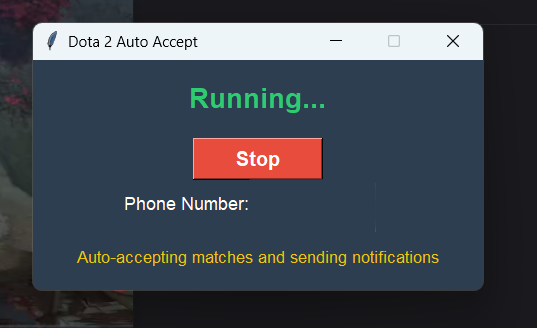

# Dota Auto Accept Script

## Interface Preview



## Setup and Compilation

### Prerequisites
- Python 3.8 or higher
- Windows 10/11

### Installation Steps
1. Clone the repository or download the script
2. Create a virtual environment (optional but recommended):
   ```
   python -m venv venv
   venv\Scripts\activate
   ```

3. Install required packages:
   ```
   pip install -r requirements.txt
   ```

### Preparing Icon and Background Image
1. Create an icon for your application (optional)
   - Use tools like Photoshop, GIMP, or online icon converters
   - Recommended size: 256x256 pixels
   - Save as `.ico` format

2. Prepare the reference image (dota.png)
   - Capture a clear screenshot of the Dota 2 match accept button *on your primary monitor where Dota 2 runs*.
   - Ensure high contrast and visibility.
   - **Resolution Compatibility:** The accuracy of button detection depends heavily on this reference image matching what appears on your screen.
     - The `dota.png` image included in this repository was captured on a **1920x1080** resolution screen with default Dota 2 UI scaling.
     - If your screen resolution, aspect ratio, or Dota 2's UI scaling settings are different, the included `dota.png` **may not work reliably**.
     - **If detection fails:** You *must* replace the `dota.png` file with a new screenshot of the accept button captured from *your own screen* with your current settings.

### Using the Compile Script (Recommended)

#### Windows
1. Ensure you have followed the installation steps and installed all prerequisites.
2. Make sure you have a `.env` file configured in the project root.
3. Navigate to the project directory in your terminal or PowerShell.
4. Run the compile script:
   ```batch
   .\compile-script.bat
   ```
5. The compiled executable (`DotaAutoAccept.exe`) will be placed in the `dist` directory.

#### Linux / macOS
**Note:** Compilation and functionality on Linux have not been specifically tested, although the script aims for compatibility. macOS testing is recommended.

1. Ensure you have followed the installation steps and installed all prerequisites.
2. Make sure you have a `.env` file configured in the project root.
3. (Optional) For a custom icon on macOS, place an `icon.icns` file in the project root. For Linux, you can try `icon.ico` or `icon.png`, but support varies.
4. Navigate to the project directory in your terminal.
5. Make the script executable:
   ```bash
   chmod +x compile-script.sh
   ```
6. Run the compile script:
   ```bash
   ./compile-script.sh
   ```
7. The compiled executable (`DotaAutoAccept`) will be placed in the `dist` directory.

### WhatsApp Notification API Integration

This script sends a notification via WhatsApp when a match is accepted by calling an external API endpoint.

1. **API Endpoint Requirement**:
   - You need to have or create your own web service/API endpoint that is capable of sending a WhatsApp message.
   - This script will make a GET request to the endpoint you provide.

2. **API Endpoint Specification**:
   - The endpoint must accept the following query parameters:
     - `phone`: The recipient's phone number (as defined in your `.env` file).
     - `password`: A password or token for authenticating the request (as defined in your `.env` file).
     - `message`: The text message content (the script sends "Match Accepted in Dota 2 and stopped the script.").
   - Example API call the script makes: `GET {API_BASE_URL}/enviar-mensagem?phone=...&password=...&message=...`
     *(Note: The specific path `/enviar-mensagem` is currently hardcoded in `dota_auto_accept.py`. You might need to adjust the script if your API uses a different path.)*

3. **Configuration**:
   - Create a `.env` file in the project root with the following variables:
     ```dotenv
     # The phone number to send the WhatsApp notification to (including country code)
     PHONE_NUMBER=+12345678900

     # The base URL of *your* API endpoint that handles sending WhatsApp messages
     API_BASE_URL=https://your-api-service.com

     # The password/token required by your API endpoint for authentication
     API_PASSWORD=your_api_password
     ```

4. **Security Notes**:
   - Keep your `.env` file secure and do not commit it to version control.
   - Ensure your API endpoint is properly secured and requires authentication (using the `password` parameter or other methods).

### Troubleshooting
- Ensure all dependencies are installed
- Verify the reference image path is correct
- Check screen resolution compatibility